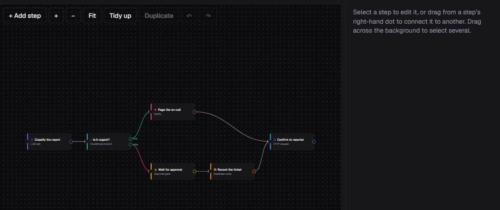

<div align="center">

# Foreman

**Self-hostable workflow automation for AI agents.**

Build multi-step workflows on a canvas, trigger them four different ways, watch
every step stream live, and pause mid-run for human approval — multi-tenant, with
permissions enforced in two independent layers.

[](https://github.com/aarohabrhm/foreman/actions/workflows/ci.yml)
[](LICENSE)
[](https://foreman-two-sigma.vercel.app)



</div>

---

## Contents

- [What it does](#what-it-does)
- [Quickstart](#quickstart)
- [Configuration](#configuration)
- [Running locally: one important limitation](#running-locally-one-important-limitation)
- [How it works](#how-it-works)
- [Development](#development)
- [Deploying](#deploying)
- [Troubleshooting](#troubleshooting)
- [Contributing](#contributing)
- [License](#license)

## What it does

A **workflow** is a directed acyclic graph of steps belonging to an
organization. You build it on a canvas — drag nodes, drag a connection from one
step's output port to another's input — and the engine derives execution order
from the connections.

Six step types are supported:

| Step type | Behaviour |
| --- | --- |
| `llm_call` | Calls Groq for a real completion. Retried once on failure. |
| `http_request` | Calls any external API — any method, headers and body, all templatable. Retried once, time-limited, response captured. |
| `db_write` | Writes a result into `db_write_results`. Owner-only to add. |
| `notify` | Enqueues a Slack message, delivered by a Hasura Event Trigger. Owner-only to add. |
| `conditional_branch` | Compares two values. The `true`/`false` label lives on the **connection leaving** this step, so one workflow can hold several independent conditionals. Steps left unreachable are recorded as `skipped`. |
| `approval_gate` | Pauses the run until an owner or editor approves. |

Steps read each other's output with `{{...}}` templates —
`{{steps.classify.output.text}}` addresses an earlier step by its reference id,
and `{{last.text}}` the one before. Paths are resolved, never evaluated as code.

Four trigger types start a run:

| Trigger | Mechanism |
| --- | --- |
| Manual | Run button in the UI |
| Webhook | Public Hasura Action, authenticated by a per-trigger bearer token |
| Scheduled | Hasura cron trigger, with per-workflow cadence |
| Database event | Hasura Event Trigger on inserts into `watched_records` |

### What it is not

Foreman is a focused engine, not a general integration platform. There are **no
loops or iteration** (you cannot fan out over an array), **no parallel branches**
(execution is strictly sequential), **no code/function step** (templates resolve
paths only), and **no credential store** — secrets go in step config or in the
environment. Runs execute in a single serverless invocation, so long workflows
can hit function timeouts.

It fits short, approval-gated automations well: call some APIs, ask an LLM,
branch on the answer, wait for a human, notify.

## Quickstart

You need [Node.js 22.14+](https://nodejs.org) and a free
[nhost](https://nhost.io) project (PostgreSQL + Hasura + Auth). No Docker, no
local database, no Hasura CLI — the schema is applied over Hasura's HTTP API.

```bash
npm install
cp .env.example .env.local     # fill in the four required values
npm run db:push                # schema + Hasura metadata
npm run db:seed                # two orgs, four users, a demo workflow
npm run dev                    # http://localhost:3000
```

Then read [the local limitation](#running-locally-one-important-limitation)
before pressing Run.

Sign in as `a-owner@foreman.test`. `db:seed` prints the demo accounts and their
password, plus a **webhook token shown exactly once** — only its SHA-256 hash is
stored.

| Account | Organization | Role |
| --- | --- | --- |
| `a-owner@foreman.test` | Northwind Support | owner |
| `a-editor@foreman.test` | Northwind Support | editor |
| `a-viewer@foreman.test` | Northwind Support | viewer |
| `b-owner@foreman.test` | Contoso Logistics | owner |

## Configuration

Copy `.env.example` to `.env.local` — it is gitignored and must never be
committed.

| Variable | Required | Where to get it |
| --- | --- | --- |
| `NEXT_PUBLIC_NHOST_SUBDOMAIN` | Yes | nhost dashboard, Overview |
| `NEXT_PUBLIC_NHOST_REGION` | Yes | nhost dashboard, Overview (e.g. `eu-central-1`) |
| `HASURA_GRAPHQL_ADMIN_SECRET` | Yes | nhost dashboard, Settings → Hasura |
| `ACTION_SECRET` | Yes | Invent one. Any long random string. |
| `GROQ_API_KEY` | No | [console.groq.com](https://console.groq.com) |
| `GROQ_MODEL` | No | Defaults to `openai/gpt-oss-20b` |
| `SLACK_WEBHOOK_URL` | No | A Slack incoming webhook |
| `SEED_PASSWORD` | No | Password for the demo accounts |

`ACTION_SECRET` is how the handlers know a request genuinely came from your
Hasura instance. The handlers are public URLs; anything arriving without the
matching secret is rejected with `401 Unauthorized caller`.

### Three settings in the nhost dashboard

All three are required, and each causes a distinct, confusing failure if missed.

**Settings → Environment Variables** — add `ACTION_SECRET` (exactly the string
from `.env.local`) and `ACTION_BASE_URL` (the public origin Hasura should call).

**Settings → Authentication → Allowed roles** — must include
`user, me, owner, editor, viewer`, default role `user`. The app sends
`x-hasura-role` per request and Hasura only honours roles the JWT permits.
Holding a role is still not access — every rule additionally requires a matching
`org_members` row.

**Settings → Sign-In Methods → Email and Password** — turn off "require verified
emails" so the seeded accounts can sign in.

### Optional integrations degrade honestly

Neither integration is faked when its key is absent — Foreman says so in the data
and in the logs.

- **Without `GROQ_API_KEY`**, an `llm_call` returns output containing
  `"stubbed": true` and logs a line saying so. The stubbed answer still varies
  with the prompt, so a `conditional_branch` reading it is genuinely exercised.
- **Without `SLACK_WEBHOOK_URL`**, a `notify` row is marked `stubbed` with a
  timestamp and the message is logged. Nothing claims to have been sent.

> **Note on `GROQ_MODEL`:** the default is a *reasoning* model — it spends tokens
> thinking before it emits any content. An `llm_call` whose `max_tokens` is too
> small has its whole budget consumed by reasoning and comes back empty. Budget
> ~256 tokens even for a one-word answer.

## Running locally: one important limitation

**Browsing works locally. Starting a run does not, unless Hasura can reach your
machine.**

Hasura runs in the nhost cloud. When you press Run, it has to call your app back
at `ACTION_BASE_URL` — and it cannot reach `http://localhost:3000`.

| Works against `npm run dev` | Needs a publicly reachable app |
| --- | --- |
| Sign in, org switching | Pressing Run |
| Browsing workflows and past runs | Approving a paused step |
| The canvas, saving workflows | Webhook, cron and database-event triggers |
| Live subscriptions on existing data | Alert delivery |

Either [deploy it](#deploying), or tunnel to your machine:

```bash
cloudflared tunnel --url http://localhost:3000
```

Then set `ACTION_BASE_URL` in nhost to the https URL the tunnel prints, and
re-run `npm run db:push` so the Actions and triggers resolve it.

If the app is unreachable, a run is created and stays at `pending`.

## How it works

```
+-------------------------------+           +-------------------------------+
| Next.js app (Vercel)          |           | nhost project                 |
|                               |  queries  |                               |
|  Pages + live subscriptions   | --------> |  Hasura GraphQL               |
|                               | <-------- |   - Layer 1 row permissions   |
|                               |   live    |   - 4 Actions                 |
|  /api/actions/*  (4 handlers) | <-------- |   - 2 Event Triggers          |
|  /api/hooks/*    (4 handlers) |   calls   |   - 1 cron trigger            |
|   - Layer 2 checks            |           |                               |
|   - run engine                | --------> |  PostgreSQL                   |
|                               |   admin   |   - schema + run state        |
+-------------------------------+           +-------------------------------+
              |
              | Groq, Slack, any external API
              v
```

Three things worth knowing:

1. **The Action handlers live in the Next.js app**, so one deployment covers both
   the frontend and the engine.
2. **Run progress is never returned through the Action.** The engine writes
   `step_runs` rows; the browser watches them over a GraphQL subscription. Close
   the tab mid-run and nothing is lost.
3. **Execution happens in its own request** (`/api/hooks/execute`). Continuing
   work after responding is unreliable on serverless.

### Two permission layers, enforced separately

- **Layer 1 — Hasura row rules** (`nhost/metadata/**`) answers *"may this caller
  touch this row?"* 80 declarative rules across 12 tables, evaluated per row on
  every request including subscriptions. Every rule joins `org_members` *and*
  pins the caller's role, so the same role in a different organization matches
  zero rows.
- **Layer 2 — application code** ([`lib/auth/layer2.ts`](lib/auth/layer2.ts))
  answers *"may this caller do this thing?"* — which step and trigger types a
  role may introduce, who may clear a specific approval gate, and whether the
  organization has quota left. These cannot be row rules; there is no row to
  filter at the moment the decision is made.

`npm run check:permissions` audits Layer 1 mechanically.

See [docs/ARCHITECTURE.md](docs/ARCHITECTURE.md) for the schema reasoning, the
full permission model, and how pause/resume is implemented.

## Development

| Command | What it does | Needs |
| --- | --- | --- |
| `npm run dev` | Dev server | — |
| `npm run typecheck` | `tsc --noEmit` | — |
| `npm run lint` | ESLint | — |
| `npm test` | 22 offline unit tests | — |
| `npm run check:permissions` | Static audit of every Layer 1 rule | — |
| `npm run db:push` | Apply migrations + merge Hasura metadata | nhost project |
| `npm run db:seed` | Demo orgs, users and workflow | nhost project |

### End-to-end tests

These run against **real infrastructure** — they sign in as real users, start
real runs and consume run quota. They are not part of CI.

| Command | Covers |
| --- | --- |
| `npm run test:e2e` | One run through its whole lifecycle, including the approval gate |
| `npm run test:triggers` | Webhook, database-event, cron cadence, notify delivery |
| `npm run test:authz` | Owner-only step and trigger rules, both directions |
| `npm run test:isolation` | Attacks Org A by ID as a real Org B user |
| `npm run test:deployed` | The full deployed chain: Hasura → Action → handler → engine |

`test:deployed` is the most convincing: it touches nothing but the public
GraphQL endpoint, so it proves the deployed wiring rather than just the code.

`db:push` **merges** Hasura metadata rather than replacing it — nhost tracks its
own `auth` and `storage` tables in the same instance, and a wholesale replace
would delete them. Both `db:push` and `db:seed` are safe to re-run.

## Deploying

Foreman is a stock Next.js app.

1. Import the repository into Vercel. **Set the Framework Preset to Next.js** —
   left as "Other", Vercel publishes only static files and every route 404s.
2. Set `NEXT_PUBLIC_NHOST_SUBDOMAIN`, `NEXT_PUBLIC_NHOST_REGION`,
   `HASURA_GRAPHQL_ADMIN_SECRET`, `ACTION_SECRET` and `GROQ_API_KEY`.
3. Deploy, then set `ACTION_BASE_URL` in **nhost** to the deployed origin.
4. Re-run `npm run db:push` so the Actions and triggers resolve their URLs.
5. Confirm with `npm run test:deployed`.

`NEXT_PUBLIC_*` values are inlined at build time, so changing them needs a
rebuild, not just a restart.

## Troubleshooting

| Symptom | Cause and fix |
| --- | --- |
| `role "owner" is not allowed` | nhost allowed-roles does not list the three role names. |
| Run stays `pending` | Hasura cannot reach the app. Check `ACTION_BASE_URL`, and see [the local limitation](#running-locally-one-important-limitation). |
| `Unauthorized caller` in the logs | `ACTION_SECRET` differs between nhost and the app. |
| `db:push` prints a `PENDING` list | `ACTION_BASE_URL` is unset on the nhost side. Schema and permissions still applied. |
| Step output contains `"stubbed": true` | No `GROQ_API_KEY`. Disclosed fallback, not a failure. |
| `Groq returned an empty completion` | `max_tokens` too small for a reasoning model. Raise it to ~256. |
| A notification's status is `stubbed` | No `SLACK_WEBHOOK_URL`. Same, for alerts. |
| `429 Too Many Requests` on sign-in | nhost rate-limits auth per IP. The scripts wait and retry. |
| `has used its quota for this period` | Monthly allowance exhausted. Resets next period, or an owner raises `quota_allowed`. |
| Every route 404s after deploy | Vercel's Framework Preset is not Next.js. |
| An `http_request` step fails with a 5xx | The external service is down. The engine retried once and reported the upstream status. |

## Contributing

Contributions are welcome. See [CONTRIBUTING.md](CONTRIBUTING.md) for setup, the
checks a pull request must pass, and commit conventions. By participating you
agree to the [Code of Conduct](CODE_OF_CONDUCT.md).

To report a security issue, please follow [SECURITY.md](SECURITY.md) rather than
opening a public issue.

## License

[MIT](LICENSE) © Aaroh
